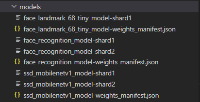

# Upasthit
An attendance tracking system that uses face recognition

[Visit the web application](https://ishika-engage.netlify.app/)


## Table of contents
- [Technology Stack](#technology-stack)
- [Features of the Application](#features-of-the-application)
- [Face API Implementation](#face-api-implementation) 
- [Installation](#installation)
- [Support and Contact](#support-and-contact)


## Technology Stack
<div>
      <p align ="left">
         <b> MongoDB</b><br><br>
        <b> ReactJS</b><br><br>
        <b> <t>NodeJS</b><br><br>
        <b> Github</b><br><br>
        <b> GraphQL</b><br><br>
      </p>
</div>

[(Back to top)](#table-of-contents)

## Features of the Application

### &ensp;Register and Login with Email ID and Password
- User information is saved in the MongoDB Cloud.
- The password is hashed first and then stored.

### &ensp;Login with Google
- Google API is used to implement the feature.
- User information is saved in the MongoDB Cloud.

### &ensp;User - Student
- At least two images for facial recognition have to uploaded by each student.
- Using course ID students can enrol into courses.


### &ensp;User - Lecturer
- Enlists a course that a student could enrol in.

### &ensp;Attendance Room
- A lecturer opens the attendance list. 
- Students can mark their attendance using webcam. 
- Attendance is marked when the face matches with the images in the database.
- Attendance cannot be marked after the lecturer has closed the attendance sheet.

### &ensp;Attendance History
- Percentage and names of absentees can be seen by both the users.

### &ensp;Remove student from a course
- The lecturer can remove students from a course.

### &ensp;Notification
- Students enroled in a course get notified when the attendance sheet is opened.

[(Back to top)](#table-of-contents)


## Face API Implementation

### Processes involved in Face Recognition
- Face registration: It is a process to store the features of a face into the file system or database.
- Face matching: It is a process to match the face between the detected features with the other existing features in our dataset either using a classifier or distance metric algorithm.

The process of face recognition includes face detection, face alignment, feature extraction and feature matching.

### Models Used

This project uses 3 pretrained models:
- Face Detection Model
- Facial Landmark Detection Model
- Feature Extraction Model

[Source Link ](https://github.com/justadudewhohacks/face-api.js/tree/master/weights)

There is a total of 8 required weight files with the respective metadata file required. Each model had been quantized to a size less than 10 MB to improve the recognition speed.

<p align="center">
    <kbd></kbd>&nbsp;&nbsp;&nbsp;&nbsp;&nbsp;&nbsp;
</p>


[(Back to top)](#table-of-contents)

## Installation
To install and run the project on your local system, following are the requirements:

### Prerequisites
- You will need a dependency managers such as npm, yarn, brew, etc.
- Download and install NodeJS if you do not have it already: https://nodejs.org/en/download/
- In CMD type "node --version" to check NodeJS have been installed.
- In CMD type "npm --version" to check Node Package Manager (NPM) also have been installed.

### Setting up the project

#### Step 1: Clone this repository.
Initialise git on your terminal.

```bash
git init
git clone https://github.com/ishikapandey/Upasthit.git
```

#### Step 2: Install the dependencies

- Open project in Visual Studio Code or any IDE.
- Open CMD in VSCode, change directory to "client" folder and install the dependency 
```bash
cd client && npm i
```
- Open another terminal, change directory to "server" folder and install the dependency
```bash
cd server && npm i
```

#### Step 3: Create an account in MongoDB Cloud and configure

- Create a project named "Upasthit" and create a cluster named "Upasthit-Cluster".
- Adding IP whitelist "0.0.0.0" to allow all network access.

#### Step 4: Create an account in Cloudinary media storage and configure

- In tab "Media Library", create folder named "Upasthit".
- Inside folder "Upasthit", create another two folders named "ProfilePicture" and "FaceGallery".
- Click Setting icon on top right.
- Under tab "Upload", scroll down until you see "Upload presets".
- Click "Add upload preset", set Upload preset name to "upasthit_facegallery" and folder set to "Upasthit/FaceGallery".
- Leave the others as default and click "Save".
- Again, click "Add upload preset", set Upload preset name to "upasthit_profilepicture" and folder set to "Upasthit/ProfilePicture".
- Leave the others as default and click "Save".

#### Step 5: Create Google OAuth Credential to enable google login and sending email

- Go to GCP console: https://console.cloud.google.com/apis.
- Create an OAuth credential for google login.
- Under tab "Credentials", click "Create Credential" and choose "OAuth client ID".
- Choose the application type "Web Application".
- Name the OAuth client name "Google Login".
- Add the javascript origin: http://localhost:3000, https://ishika-engage.netlify.app
- Add the redirect uri: https://developers.google.com/oauthplayground.
- Click "Save".
- Create an OAuth credential for email sending.
- Under tab "Credentials", click "Create Credential" and choose "OAuth client ID".
- Choose the application type "Web Application".
- Name the OAuth client name "Mail".
- Add the javascript origin: http://localhost:4000, https://ishika-engage.netlify.app
- Add the redirect uri: https://developers.google.com/oauthplayground.
- Click "Save".
- Under tab "OAuth Consent Screen", enter the required info (app name, app logo, app uri, privacy policy, etc).

#### Step 6: Configure server environment variables.

- Inside the "server" folder, create a file named ".env" used to save the credential data of database, API and so on.
- Inside ".env" file, create 10 variables named "MONGO_URI", "SECRET_KEY", "CLOUDINARY_NAME", "CLOUDINARY_API_KEY", "CLOUDINARY_API_SECRET", "GOOGLE_OAUTH_USERNAME", "GOOGLE_OAUTH_CLIENT_ID", "GOOGLE_OAUTH_CLIENT_SECRET", "GOOGLE_OAUTH_REFRESH_TOKEN" and "GOOGLE_OAUTH_REDIRECT_URI".
- Assign values to these variables from the accounts created above.

[(Back to top)](#table-of-contents)

## Support and Contact
Email To: ishikapandey070@gmail.com
<br/>
[(Back to top)](#table-of-contents)
